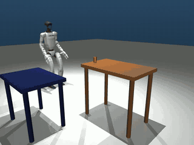
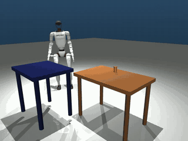

# Lucky Robots Pick & Place Challenge

> **My solution:** the approach, results and how to run it are in [WRITEUP.md](WRITEUP.md). The rest of this README is the original challenge brief.

| IK pipeline (`shipped`, seed 3, episode 0) | Direct HL (`hl_full`, seed 3, episode 4) |
|---|---|
|  |  |

## Overview

We're inviting you to tackle an open-ended robotics manipulation problem. This isn't a test with a correct answer — it's an opportunity for us to understand how you approach novel challenges, decompose complex problems, and iterate toward solutions.

**The task: Get the G1 humanoid robot to pick up the red cylinder from the brown table and place it on the blue table.**

That's it. Everything else is up to you. Solve with VLM/VLA, IK logic, some custom policy, doesn't matter. 

## What's Included

This repo contains a fully working MuJoCo simulation of a Unitree G1 humanoid robot standing near two tables — a brown table with a red cylinder on it, and a white target table nearby. The robot comes with pre-trained locomotion (walker) and right-arm reaching (reacher) policies that you can use, modify, extend, or replace entirely. There's also a simple "grab" functionality that you can use if you like.

Two cameras are supplied in the scene. One mimics the existing head camera and another is attached to the hand.

```
picknplace_takehome/
├── run.py              # Main simulation script with keyboard control
├── scene.xml           # MuJoCo scene (brown table, blue table, red cylinder, cameras)
├── g1.xml              # G1 robot model (29 DoF, head + wrist cameras)
├── model_config.json   # Joint configuration, action scales, PD gains
├── walker.onnx         # Pre-trained walking policy (99D obs → 29D action)
├── croucher.onnx       # Pre-trained crouching policy
├── rotator.onnx        # Pre-trained rotation policy
├── right_reacher.onnx  # Pre-trained right arm reaching policy (36D obs → 7D action)
├── assets/             # G1 robot mesh files (.obj)
└── README.md           # This file
```

### Prerequisites

```bash
pip install mujoco onnxruntime numpy opencv-python
```

### Running the Demo

```bash
python run.py
```

This opens a MuJoCo viewer with the G1 robot and two camera windows (head cam, wrist cam). Controls:

| Key | Walk Mode | Reach Mode |
|-----|-----------|------------|
| `.` | Switch to Reach | Switch to Walk |
| Up/Down | Walk forward/back | Reach forward/back |
| Left/Right | Strafe left/right | Reach left/right |
| `;` / `'` | Turn left/right | Reach up/down |
| `\` or `/` | Stop | Reset reach target |
| `,` | Toggle right hand grip (open/close) | Toggle right hand grip (open/close) |
| Space | Reset robot | Reset robot |

The walk/reach toggle and keyboard control are there so you can get a feel for the robot and the scene. Your job is to automate it.

### What the Policies Do

- **Walker** (`walker.onnx`): Takes velocity commands (vx, vy, yaw_rate) and produces stable bipedal locomotion. 99D observation → 29D joint targets.
- **Right Reacher** (`right_reacher.onnx`): Takes a target position/orientation in pelvis frame and drives the right arm toward it. 36D observation → 7D arm joint targets. The reacher overlays on top of the walker — legs keep walking while the arm reaches.

The policies use PD control through MuJoCo's built-in position actuators. See `run.py` for the full observation/action pipeline.

### The Robot

The Unitree G1 has 29 actuated degrees of freedom:
- **Legs (12 DoF)**: 6 per leg (hip pitch/roll/yaw, knee, ankle pitch/roll)
- **Waist (3 DoF)**: yaw, roll, pitch
- **Arms (14 DoF)**: 7 per arm (shoulder pitch/roll/yaw, elbow, wrist roll/pitch/yaw)

Each hand has a **Unitree Dex3-1** 3-finger dexterous hand with 7 actuated joints: thumb (3 DoF), index finger (2 DoF), and middle finger (2 DoF) — 14 finger DoF total across both hands. The finger actuators use position control and are available via `data.ctrl`. See the actuator list in `g1.xml`.

### The Scene

- **Brown table** (source): 80cm x 50cm surface at 71.3cm height, in front of the robot
- **Blue table** (target): 70cm x 50cm surface at 61.3cm height, to the robot's right
- **Red cylinder**: 4cm diameter, 7cm tall, on a freejoint (fully dynamic). Starts on the brown table near the edge closest to the robot
- **Cameras**: `head_cam` (on torso, looking forward from head height), `wrist_cam` (on right palm, looking outward)

## What We Care About

We want to see how you solve the problem.

Specifically:

- **Problem decomposition.** How do you break this into tractable sub-problems? What do you identify as the core challenges (approach, grasp strategy, lift coordination) versus incidental ones?
- **Decision-making under uncertainty.** Why did you choose the tools, methods, and approaches you chose? What alternatives did you consider and reject?
- **Iteration and learning.** What did you try that didn't work? What did that teach you? How did your understanding of the problem evolve?
- **Technical communication.** Can you explain your reasoning clearly to someone who wasn't in your head while you were working?

## Constraints (or Lack Thereof)

- **Simulation**: MuJoCo is provided and set up, but you can port to another simulator if you have a strong reason to.
- **Policies**: You can use the provided walker/reacher as building blocks, fine-tune them, train new ones from scratch, or bypass learned policies entirely with analytical controllers. Your call.
- **Approach**: Reinforcement learning, trajectory optimization, motion planning, hand-tuned controllers, vision-based policies using the cameras, some hybrid — all valid. We're interested in *why* you chose what you chose.
- **Grasp strategy**: The Inspire hands have 3 fingers each — how you coordinate them for a reliable grasp is up to you. Pre-programmed grip, learned grasp policy, force-based closure, something else entirely — your call.
- **Code assistance**: We don't care if you use coding models to assist you, but you need to understand what was done and be able to explain it.

## Deliverables

1. **Code** sufficient for us to understand and reproduce what you did. Cleanliness matters less than clarity — comments explaining your thinking are more valuable than pristine architecture.
2. **A short video** showing your best result and progress, even if the cylinder never makes it to the blue table. Partial progress is real progress.
3. **A brief write-up** (PDF, Google Doc, or Markdown) covering:
   - Your approach and why you chose it
   - What worked, what didn't, and what you learned
   - What you'd do next with more time

## Evaluation

| What | Why it matters |
|------|---------------|
| Problem analysis | Did you identify the right challenges? How did you decompose the problem? |
| Methodological reasoning | Can you justify your choices? |
| Adaptability | How did you respond when things didn't work? |
| Technical depth | Do you understand the tools you're using? |
| Communication | Can you explain complex ideas clearly? |

## Some Questions to Consider

You don't need to answer all of these, but they might help structure your thinking:

- How do you decompose this into phases (approach, grasp, transport, place)? Can they overlap?
- How do you coordinate locomotion and manipulation? Does the robot need to stop walking to reach?
- The provided reacher targets a point in pelvis frame — how do you decide *what* to target and *when*?
- How would you use the wrist camera? The head camera? Do you need them?
- How do you verify the cylinder is actually grasped before trying to move? How do you verify it's placed?
- Where does sim-to-real transfer factor into your thinking (even if you're not doing it)?

## Submission

Send us:
- Your write-up (PDF, Google Doc, or Markdown)
- A link to a repo or zip of your code
- Your video (or a link to it)

Email to: **harrison@luckyrobots.com**, cc: **nur@luckyrobots.com**

Questions before and during are welcome.
