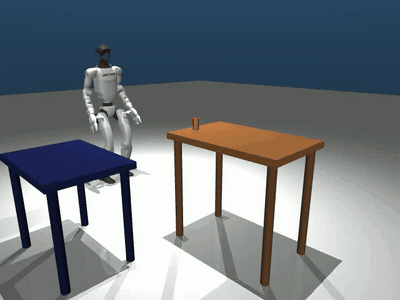
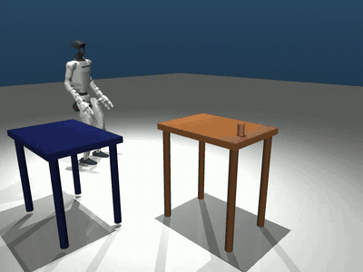

# G1 Pick & Place: Write-up

## Overview

The robot walks to the brown table, picks up the red cylinder, carries it, and places it upright on the blue table. This branch contains two controllers:

- **The IK pipeline**: a scripted controller built on the provided walker, rotator and croucher, with its own arm IK and grasp.
- **The direct HL**: a small learned policy that makes the pipeline's pick decisions (stance, crouch, grasp) and leaves the rest to the pipeline.

An episode succeeds when the cylinder is **on the blue table, tilted 10° or less, and still at rest after a 2-second settle**.

| Controller | Task | Success |
|---|---|---|
| IK pipeline | `shipped`: the task as shipped, robot spawn ±15 cm / ±15°, cylinder within 10 cm of nominal | **425/450 = 94.4%** |
| IK pipeline | `shipped_table`: same, cylinder anywhere on the brown tabletop | **400/450 = 88.9%** |
| IK pipeline | `hl_full`: wide randomization (see below), seed 3 | 90/200 = 45% |
| Direct HL | `hl_full`, seed 3 | 83/200 = 41.5% |

The 450-episode figures pool nine seeds. On the three seeds the pipeline was developed against they read 97.3% and 90.7%, so the nine-seed numbers are the honest ones.

### Demo

| IK pipeline (`shipped`, seed 3, episode 0, 8x speed) | Direct HL (`hl_full`, seed 3, episode 0, 14x speed) |
|---|---|
|  |  |

Both are successful episodes from the regression tests, rendered with `eval/sweep.py --video`.

```
g1-manipulation-challenge/
├── ik/
│   ├── pipeline.py     # The IK pipeline end to end (run_once) and the COMMANDER seam
│   ├── sim.py          # Simulation runner, arm IK, Cartesian palm paths, the walk
│   └── base.py         # Base-pose primitives over the walker, rotator and croucher
├── hl/
│   ├── commander.py    # The direct HL: stance, crouch, grasp and re-stance decisions
│   ├── train.py        # Fits the HL's success models from sweep results
│   └── models/direct.pt  # The trained HL
├── eval/sweep.py       # Randomized episode harness, presets and failure taxonomy
├── tests/              # Episode-for-episode regression tests (golden.json)
└── run.py, scene.xml, g1.xml, *.onnx   # The provided simulation, unchanged
```

### Running

```bash
pip install mujoco onnxruntime numpy opencv-python torch

python -m ik.pipeline                                              # one episode
python eval/sweep.py -n 200 --seed 3 --preset shipped -j 8          # sweep the IK pipeline
G1HL_COMMANDER=direct:hl/models/direct.pt \
  python eval/sweep.py -n 200 --seed 3 --preset hl_full -j 8        # sweep the direct HL
python -m pytest tests/test_regression.py -q                       # regression tests
```

The physics is deterministic for a fixed scene, so the regression tests replay recorded episodes and check that each one reproduces exactly.

## Approach

The problem splits into four layers, with learning deliberately last:

| Layer | What it does | How |
|---|---|---|
| **High level** | Choose the pick and place stance, crouch and grasp geometry | Search over a kinematic feasibility map (or the direct HL) |
| **Base** | Walk, rotate or crouch to a commanded pose | Provided ONNX policies, frozen |
| **Arm** | Move the palm to a commanded 6-D pose | Damped-least-squares IK and Cartesian waypoint paths |
| **Hand** | Close on the cylinder and hold it | Scripted finger schedule |

**Why this order.** The provided policies are a fixed asset, and the arm is a solved kinematics problem. The hard part, contact, is small and comes late. Training a policy first would have meant optimizing against a pipeline whose failures were not yet understood, and every early failure turned out to have a cause that measurement could find and geometry could fix.

### The IK pipeline

| Phase | What happens |
|---|---|
| Approach | Walker and rotator dock the base at a pose, routing around the tables (the walker cannot turn in place, the rotator cannot translate) |
| Pick stance | Searched from the pose actually reached: a feasibility map over cylinder offsets, corrective legs, and the approach side, crouching when standing cannot reach |
| Grasp | An explicit path: standoff behind and above, horizontal traverse, vertical descent. The geometry is derived from the finger mesh |
| Carry | The hand is rolled into a "cradle" so gravity seats the cylinder in the fingers, then tucked near the body |
| Place | Walk to the blue table, a contact-monitored descent, a seat press, and a thumb-first release |

The provided reacher is not used for the arm: it has an 8 to 14 cm bias, while the IK arm reaches within 0.6 cm on average.

### The direct HL

The HL never moves a joint. It drives the pipeline through one seam (`ik.pipeline.COMMANDER`) and replaces the pipeline's stance search entirely:

1. **Pick**: command a stance relative to the cylinder and a crouch height.
2. **Grasp**: after the walk, from where the robot actually landed, choose a grasp tilt, curl side and approach angle, or decline and command a new stance (at most twice).

The walk, arm path, carry and place are the pipeline's. Two small MLP ensembles score P(success) for the stance and for the grasp. They were trained on 2,230 episodes: 1,000 with uniform commands, then six rounds of on-policy collection (Thompson sampling), which raised the success rate from 18.5% to 31.5%.

It is measured on `hl_full`, a harder randomization than the task asks for: spawn ±30 cm / ±45°, both tables moved ±15 cm, tabletop heights 0.60 to 0.80 m and 0.50 to 0.72 m, footprints scaled ±25%. Seed 3 is held out from all training.

## What worked

- **Making the grasp path explicit.** The original hand-tuned grasp only worked because a per-joint rate limiter bowed the palm 4 to 14 cm above its straight-line path, so it came down onto the cylinder by accident. Flying the intended shape on purpose (standoff, traverse, descent) took capture from 7/25 to 19/25.
- **Searching the approach side.** Letting the stance search pick which side of the cylinder to approach from took `shipped_table` from 28% to 76.7%. Cylinders 30 to 90 cm from nominal went from 0/48 to 72/80.
- **Lifting clear of the tabletop before traversing.** `shipped_table` 76.7% → 89.3% (three seeds).
- **Choosing grasp tilt by measurement.** `shipped` → 97.3% (three seeds).
- **Holding still.** The cylinder was often lost about a second *after* the arm stopped. The small command steps during motion had been shaking the contact. Bounding each finger's command against its own measured angle fixed it, and shorter settles turned out to be better, not worse.
- **For the HL, labelling with success instead of the lift.** Grasps trained to lift lifted more but carried worse, because tilt and approach angle set the in-grip pose the carry inherits.

## What didn't work

- **Commanding the script's own choices.** An earlier HL that chose the pipeline's stances and crouch depths scored 91/200 against the script's 93/200 at the same retry budget. The pipeline's replanner corrects any stance it is given, so the stance carries almost no signal.
- **The direct HL does not beat the script.** 83 vs 90 on the same 200 scenes (p = 0.51, so not a significant difference either way). Once the cylinder is lifted, both convert about 60%, so the gap is in the pick. It is faster, though: median 71 s of wall time per episode against 121 s.
- **Where the HL fails.** Of its 61 failed picks, 14 were never picked by any controller, all with the brown table at its lowest (0.60 to 0.63 m). In the rest, the walk stops a median 17 cm from the commanded stance (10 cm in successful picks), and the script's corrective legs recover from that where one shot does not.

## What I learned

- **Build the instrument before changing the behaviour.** End-to-end sweeps mix every layer together, so each layer got its own harness (a static grasp grid, a place grid) to test it in isolation.
- **The pipeline is chaotic.** Respawning the cylinder at its rest height instead of dropping it from 12 cm, which gives an identical resting position, flips the nominal episode from success to failure. No single-episode result means anything; only sweeps do.
- **Read the task before randomizing it.** For several milestones I evaluated against a friction and mass range I had invented. `scene.xml` fixes the cylinder at μ = 3.0, which is the value the pipeline handles best. A randomization is a choice and has to be labelled as one.
- **Clean correlations can be confounds.** Grasp tilt looked like it governed capture (0/10 above 25°), but the real variable was pinch height. A controlled replay at fixed geometry exposed it before the wrong fix was built.
- **Instruments can mislead.** A grasp grid spanning only part of the real offset range read 76% where the honest number was 35%, and a "seated" metric turned out to be anti-correlated with end-to-end success.

## What's next

1. **Close the landing gap for the HL.** Give the direct HL a corrective step after the walk, as the script has, since landing error is what separates its failed picks from its successful ones.
2. **Low tables.** The brown top below 0.63 m is never picked by anything. It needs a deeper crouch or a different grasp, not a better stance.
3. **Use the cameras.** This solution is state-based. The head and wrist cameras could replace the cylinder's ground-truth pose, for example by distilling the pipeline into a vision policy.

## Limitations

- The grasp is a scripted schedule. Its robustness comes from the stance search and the path geometry, not from a learned hand.
- On `hl_full` both controllers are below 50%, so the wide randomization is far from solved.
- The cameras are unused.
